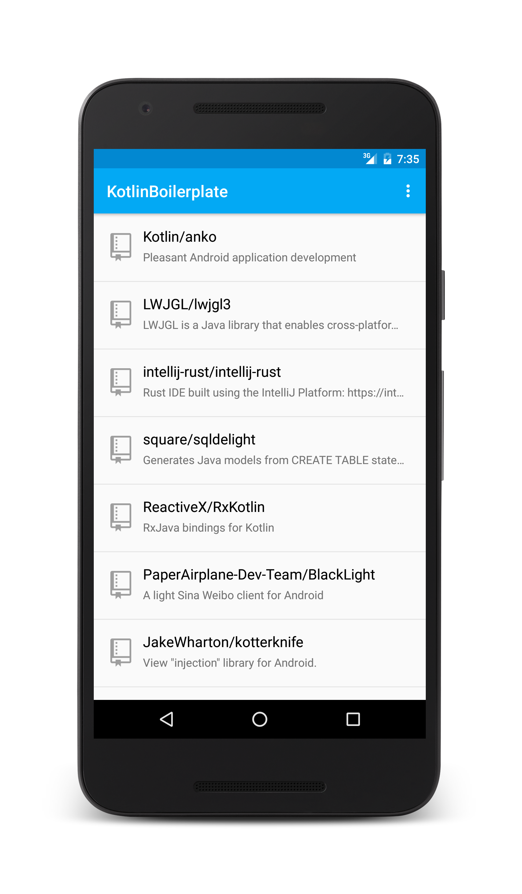
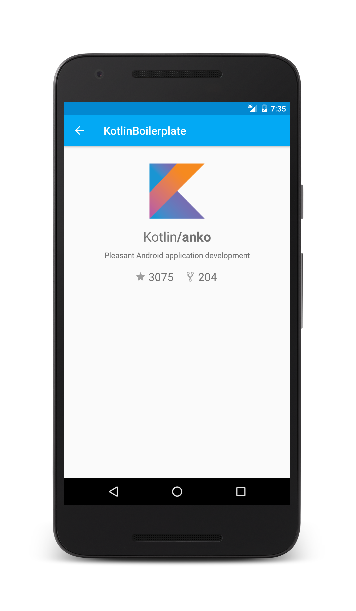
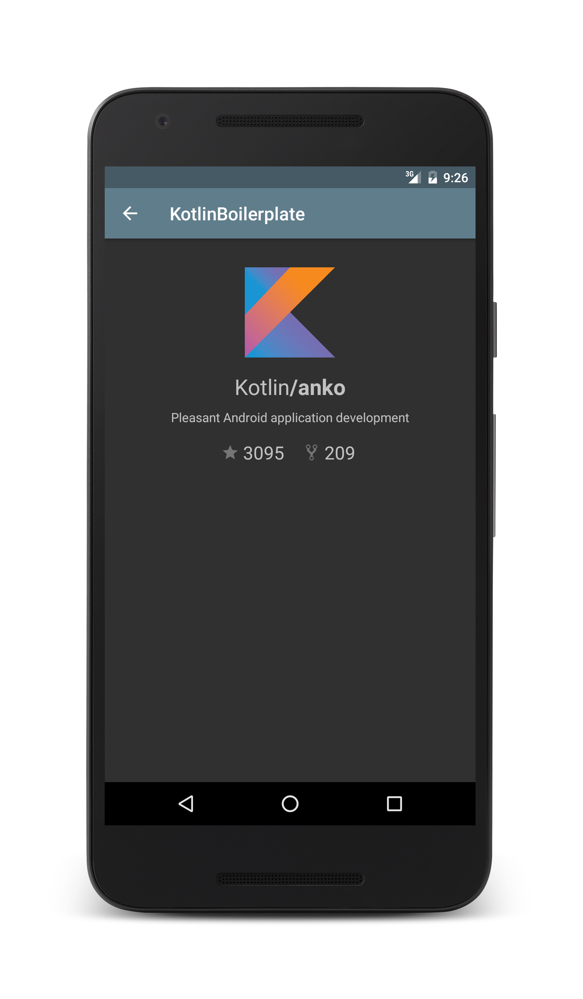

# Kotlin-Android-Boilerplate

<p align="center">
    
</p>

An MVP Boilerplate Android project written in [Kotlin](https://kotlinlang.org/). This sample
application fetches the top starred Kotlin repositories from Github and displays them. Inspired by
@hitherejoe's [Android-Boilerplate](https://github.com/hitherejoe/Android-Boilerplate) project.

## Screenshots






## Libraries
* [Dagger 2](http://google.github.io/dagger/)
* [RxJava](https://github.com/ReactiveX/RxJava) and [RxAndroid](https://github.com/ReactiveX/RxAndroid)
* [Retrofit 2](http://square.github.io/retrofit/)
* [Picasso](http://square.github.io/picasso/)
* [PaperParcel](https://github.com/grandstaish/paperparcel)
* [Google Support Libraries](http://developer.android.com/tools/support-library/index.html)

## Testing Libraries
* [JUnit](http://junit.org/junit4/)
* [Mockito](http://mockito.org/)

## Requirements
To compile and run the project you'll need:

- [Android SDK](http://developer.android.com/sdk/index.html)
- [Android N (API 24)](http://developer.android.com/tools/revisions/platforms.html)
- Android SDK Tools
- Android SDK Build Tools `24.0.2`
- Android Support Repository
- [Kotlin](https://kotlinlang.org/) `1.0.4`
- Kotlin plugin for Android Studio

Building
--------

To build, install and run a debug version, run this from the root of the project:

```
./gradlew assembleDebug
```

Testing
-------

To run **unit** tests on your machine:

```
./gradlew test
```

To run **instrumentation** tests on connected devices:

```
./gradlew connectedAndroidTest
```


## Release Builds
A release build needs to be signed with an Android Keystore. The easiest way to generate a keystore is to open
Android Studio and go to `Build -> Generate Signed Apk -> Create New...` After that you need to create a
`signing.properties` file in the root directory and add the following info to it:
```INI
STORE_FILE=/path/to/your.keystore
STORE_PASSWORD=yourkeystorepass
KEY_ALIAS=projectkeyalias
KEY_PASSWORD=keyaliaspassword
```
Running `./gradlew assembleRelease` will then build and sign a release version of the app.

## FAQ
#### Why Kotlin?
In a nutshell, Kotlin throws all the bad parts of Java out the window and brings lots of great features from
Java 8 and functional programming (Yet still compiling to Java 6 bytecode). Kotlin brings much needed language
features to Android which is stuck on Java 6.

#### Why MVP?
MVP architecture lends itself to Android since it separates Android code from normal business logic.
This makes your application much easier to test.

#### What is with all the interfaces?

By default Kotlin classes are closed (`final`). This makes them hard to mock unless you use a tool like
[Powermock](https://github.com/jayway/powermock). I'd rather just mock interfaces with [Mockito](http://mockito.org/)
than go through the hassle of using Powermock.

#### How do I use this project?
This is a boilerplate project aimed to help bootstrap new Kotlin applications. Feel free to fork this application
or use this project [generator](https://github.com/ravidsrk/generator-kotlin-android-boilerplate). Don't
forget to change the following things for your application:

* Application ID (Gradle)
* Application Name (String resource)
* Package names

## Attributions
- [Kotlin Logo](http://instantlogosearch.com/kotlin)
- [Github Icons](https://octicons.github.com/)